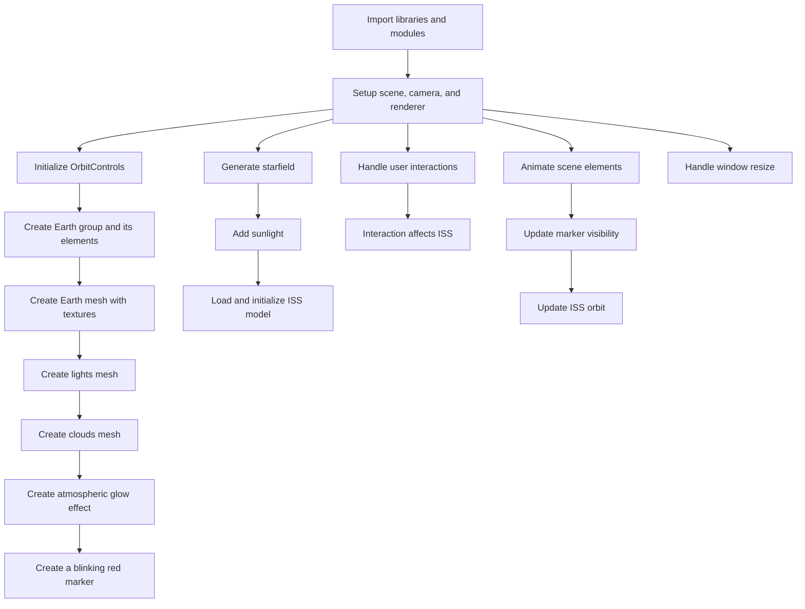

```mermaid
graph TD
    A[Import libraries and modules]
    B[Setup scene, camera, and renderer]
    C[Initialize OrbitControls]
    D[Create Earth group and its elements]
    E[Create Earth mesh with textures]
    F[Create lights mesh]
    G[Create clouds mesh]
    H[Create atmospheric glow effect]
    I[Create a blinking red marker]
    J[Generate starfield]
    K[Add sunlight]
    L[Load and initialize ISS model]
    M[Handle user interactions]
    N[Interaction affects ISS]
    O[Animate scene elements]
    P[Update marker visibility]
    Q[Update ISS orbit]
    R[Handle window resize]

    A --> B
    B --> C --> D
    D --> E --> F --> G --> H --> I
    B --> J --> K --> L
    B --> M --> N
    B --> O --> P --> Q
    B --> R
```